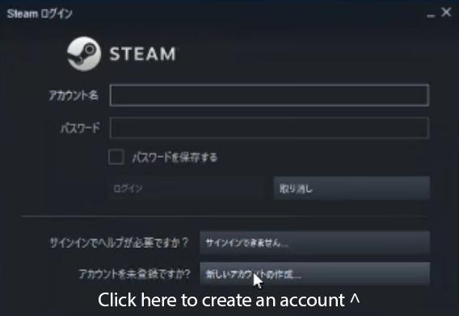
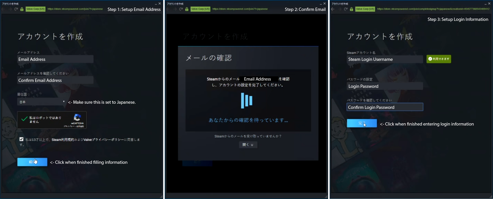
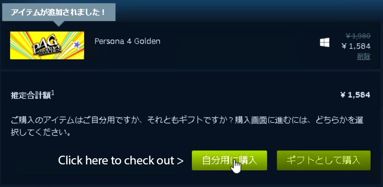
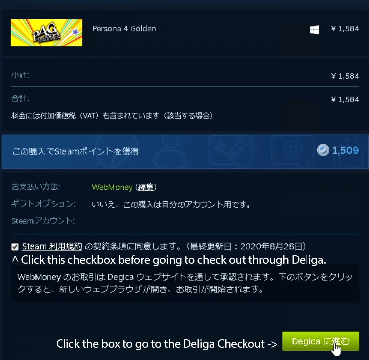
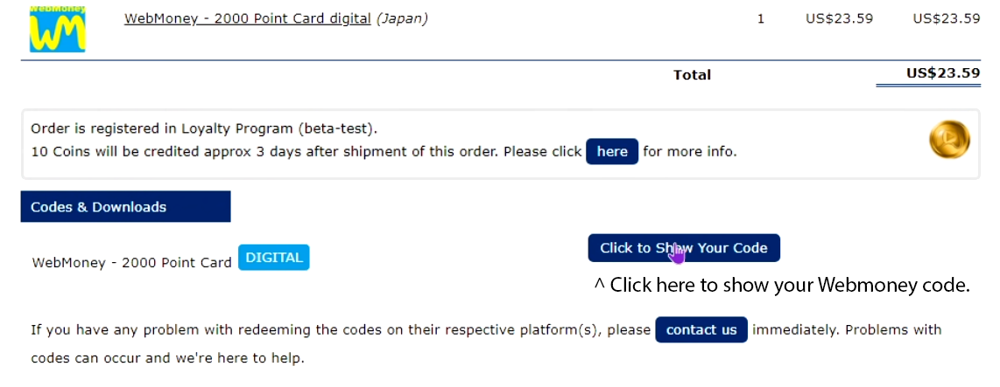
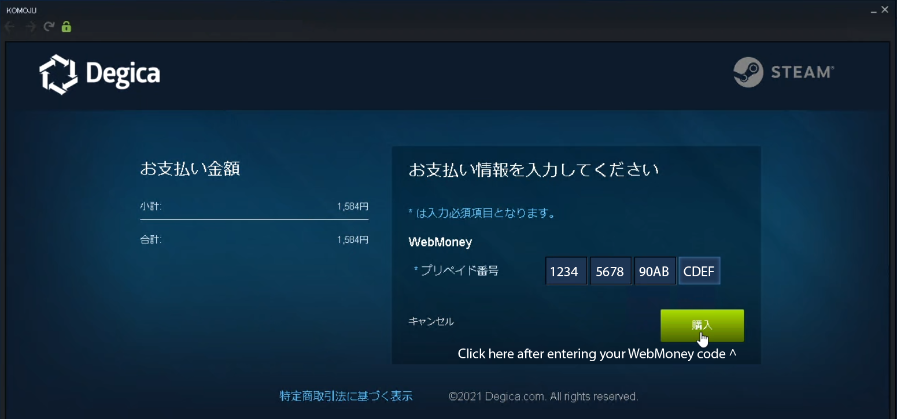

## Table of contents:

1. [How to buy the game (Before using our English Patch)](#How to buy the game)
2. [Installation Instructions](#Installation Instructions)
3. [Frequently Asked Questions](#Frequently Asked Questions)

#### How to buy the Game (Before using our English Patch): 

The game unfortunately is region locked (including playing through Steam Family Sharing), which requires you to either log into the account with the game to play or use a Steam API emulator (Which due to the legally gray area of that process, won't be covered here) if you can't be bothered to constantly switch accounts. This guide is written under the assumption that you are going to be buying the game from the Japanese Steam storefront. For technicality (and payment processing) reasons, this guide doesn't cover buying with the Korean/China/S.E.A version's pricing. As of currently, buying the Japanese version costs more, but is the most convenient (due to how Steam doesn't deny using a gift card as a payment method, due to that being a prominent way of paying for digital games in Japan) to set up.

***Prerequisites:***

* A VPN that can give you a *Japanese* IP address (You can either use [OpenVPN](https://openvpn.net/vpn-client/) with a [Server Finder](https://addons.mozilla.org/en-US/firefox/addon/free-openvpn-server-finder/https:/) if you don't particularly care about anonymity/security, or you can use a paid VPN service like [ProtonVPN](https://protonvpn.com/) for this), which will be needed during the process of creating a new Steam account. This guide is written under the assumption that you know the basics of how to work with a computer, so come back when you have this set up.
* *About* $105 to spend on a WebMoney card. [You can buy one from PlayAsia.](https://www.play-asia.com/webmoney-10000-point-card/13/70dw33) Even if you'll only be spending *about* $90 (excluding Japanese sales tax) of that on the game.

    *Alternatively, you can either buy a [3000 JPY Steam Wallet Card](https://www.play-asia.com/steam-gift-card-jpy-3000-for-japan-currency-only/13/70exkp) simply to activate your account after crediting at least 1000 JPY (and then gift the remaining amount through [digital Steam gift cards through your regular Steam account](https://store.steampowered.com/digitalgiftcards/) to buy the game after friending the Japanese Steam account and waiting three days before gifting is available), or buy two [5000 JPY Steam Wallet Cards](https://www.play-asia.com/steam-gift-card-jpy-5000-for-japan-currency-only/13/70exkj) if you are willing to pay $12 or so on PlayAsia tax. If you really hate them for some reason, and want to minimize the amount you give them the 3000 JPY card is the path of least resistance on that front, at the cost of convenience. Either way, you would redeem those codes [here](https://store.steampowered.com/account/redeemwalletcode) while signed into the Japanese Steam account. This brief blob should give an explanation of that process, but it will not be explained in detail here.*

* If you are extra paranoid about your system being tied back to your main Steam account, a Virtual Machine or sandbox environment containing any operating system that runs Steam (Although this guide is written under the assumption you use Windows). [VirtualBox](https://www.virtualbox.org/), [VMWare Workstation Player](https://www.vmware.com/products/workstation-player.html), GNOME Boxes (If you are using Linux), or Microsoft's built-in virtualization tools (Hyper-V Manager and/or Windows Sandbox) are a few examples of Virtual Machine environments you can use for extra security. For brevity, this guide won't be covering that process.

**With those things taken care of, here's a guide (with some images) on the process of buying the Japanese release:**

1. Make sure to connect to the Japanese VPN server, and if using a Virtual Machine, install the Steam Client using the Japanese language in the install process (Just to be safe, although you can always change your preferred language later without affecting your Steam account region).
2. When you reach the Steam login screen, press the lowest button to create an account.
   
3. Follow the process in this image to create a Japanese Steam account.
   
4. After you find the game on Steam [(You can easily grab the game here)](https://store.steampowered.com/app/1046480), add it to your cart, and check out. For the example going onwards, Persona 4 Golden will be used as an example, but the process is the same for this game.
   
5. When selecting the payment method, select *"WebMoney"* as the payment method.
   
6. Afterwards, follow the process here to enter the Deliga checkout that is used for WebMoney. A new window should open for this process.
   
7. In the meantime, go to the order page for the WebMoney you bought, and then click the *"Show Code"* button and confirm with the notice that appears to get the WebMoney code that will be used in the next step. Make sure to copy it down somewhere.
   
8. In the Deliga checkout window that appears, enter in the WebMoney code and press the green button afterwards.
   
9. From here on, the process should be like buying any average game through your region on Steam. Finish the checkout process.

After the process has been finished and the game appears in the Steam Library, ***Congratulations!*** You've *officially* bought the game and supported the developers! All that needs to be done now is installing the game!

#### Installation Instructions: 

1. Download the English Patch (This will likely be in a ``.zip`` archive), and open it with either Windows' built-in ZIP file viewer/extractor, 7-Zip, WinRAR, or the dozens of other alternatives available for creating/extracting compressed archive files.
2. Go to the game boxart (Or just the game's title on the list view) on Steam, and right click it, then go to *"Browse Local Files"*, which can be found in the *"Manage"* portion of the context menu.
3. Enter the ``StarlitSeason`` directory of where the game is installed, then enter the ``Content`` directory, and then finally the ``Paks`` directory.
4. Create a folder called ``~mods`` inside of the ``Paks`` directory, and enter it. Make sure that the "~" exists, otherwise, the patch won't load.
5. Extract ``pakchunk99-EngPatch.pak`` and ``pakchunk99-EngPatch.sig`` into the newly created "~mods" folder we just made.

This *should* be the final result. If you did it like this, you deserve a cookie:

***Congratulations!*** The English patch is now installed! Feel free to check up on updates on the patch in case any future game updates on Steam breaks things.

#### Frequently Asked Questions: 

##### Q: When should we expect a release?

**A:** We don't have a definitive answer on that. We're still working on getting the UI translated, and things will be set into high gear once COMMU/Story Mode translation begins, and when we can find some more experienced translators to help. We are still working on getting a solid ground foundation for workflow for several things situated, and we also need to get the word count locked in place before we can approach anyone regarding contributing. Despite the fact that the game is using Unreal Engine 4, we still have some work to do in terms of tool development to help automate the building and testing process. The process of releasing an English fan translation patch that is faithful to the source material, while also not being ripe with machine translation or "Keikaku Means Plan" jank could take months or even years. We are simply a team that is working on this project in their spare time, with no profit incentive involved. The script is pretty long, with 28 idols that have about 12-15 COMMU skits each, plus story content and dialogue from other characters, and this isn't even accounting translating any DLC content that may release.

TLDR: When it's done.

##### Q: Which officially supported language option will this patch be based on?

**A:** The Japanese version.

##### Q: How can we give support?

**A:** If you are an experienced translator, and can provide some sort of track record (Whether that's official or unofficial), feel free to hit us up. If you want to give us monetary support, we aren't accepting cash donations. However, please consider buying a copy of the game for you and maybe a friend. Please support an official English release if one ever does happen.

##### A: Is there any more legal stuff to keep in mind?

**A:** We aren't interested in stepping on anyone's toes, legally speaking, and we aren't releasing material that would infringe copyright laws. We aren't releasing unmodified game files, cheating utilities, or DLC unlocking tools either, so we aren't generating a profit loss for the publishers.

##### Q: Will you publicly release any sort of tools, or anything of that sorts which could help translate to other languages?

**A:** At some point once the patch is finished (and when the tools have been properly stress-tested), we do indeed have plans on publicly releasing internal development tools (and their source code), translation spreadsheets, and everything else that isn't publicly available that's needed to build a functional translation patch up on a Git repository. For now, these tools will only be available internally to those collaborating, but we do have plans on doing that. It will ideally be under a software license similar to the GPL, to ensure that these tools remain open for anyone to look at and to contribute.

##### Q: Will you be censoring/altering any content?

**A:** **No.** This needs to be *abundantly* clear. Transparency is the best way to go about things, especially with a localization project, where tastes massively differ. Especially as of recently, where "localization" has become a bit of a controversial subject and a dirty word in gaming and anime communities, due to the actions of an infamous few *(Won't name any examples here, sorry)*. We believe that while a certain level of localization is needed to be done to dialogue and other things to make it flow better in a structurally and fundamentally different language, we aren't changing anything that would change the context of characters, events, or sub-cultures that it could have taken influence from, in a way that's respectful to the source material. We recently did a survey regarding how we should handle certain things, and we have an idea on what kinds of practices we should follow. Games are inherently an artistic medium, and moral relativism is ultimately subjective. If you don't like *any* of our creative decisions, *you are free to make your own translation project*, as one would say. If you find anything personally objectionable, take that up with the developers, and not us.

##### Q: How come the Visual Lessons are harder than I remember?

**A:** Due to technical issues, the Visual Lessons button prompts were changed slightly as the original button prompts were designed around Japanese sentence structures, which will not work in English. A compromise had to be made, and this resulted in a slight change to the input prompts that you should ignore. Here is a visual comparison:

